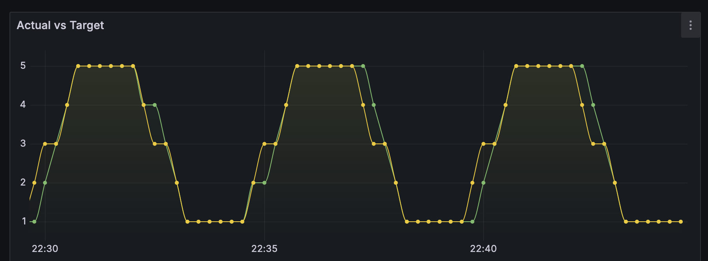

# Freyr

Freyr is an example Go Kubernetes Operator using operator-sdk.

## Getting Started
```shell
# https://sdk.operatorframework.io/docs/building-operators/golang/tutorial/
cd freyr
operator-sdk init --domain=fmtl.au --owner=nick@fmtl.au --project-name freyr;
operator-sdk create api --group freyr --version v1alpha1 --kind Ship --resource --controller 
```

## Directories:
* `docker`: Kube in Docker related resources
* `k8s`: Kube Demo resources
* `ship-operator`: Operator SDK Demo code
* `svc_captain`: The captain service that the ship Operator deploys
* `svc_conscript`: The conscript service that the ship Operator deploys

## Resources:
* [Operator SDK Go](https://docs.okd.io/latest/operators/operator_sdk/golang/osdk-golang-tutorial.html#osdk-run-operator_osdk-golang-tutorial)

## What is it

Freyr is a k8s operator, which manages a basic Captain/Conscript worker registration webapp.

When deployed, it will deploy an operator which manages [Ship](ship-operator/api/v1alpha1/ship_types.go) resources (CRD)

Given the following ship manifest, the following will be deployed:
```yaml
apiVersion: freyr.fmtl.au/v1alpha1
kind: Ship
metadata:
  name: black-pearl
  namespace: my-namespace
spec:
  registry:
  mode: trig
  trig:
    duration: 300s
    min: 1
    max: 6
```


## Modes:
* Trig - trigonometric mode. Scale the conscripts based on a generated Sine wave
* Weather - weather mode. Scale the conscripts based on the current temperature of a given city.
  * Uses [openweather api](https://openweathermap.org/current)

View the [Ship](ship-operator/api/v1alpha1/ship_types.go) for more information.

## Demo

When the application is deployed and configured, the Captain deployment should be able to report
via api request about the current state of things. EG:



