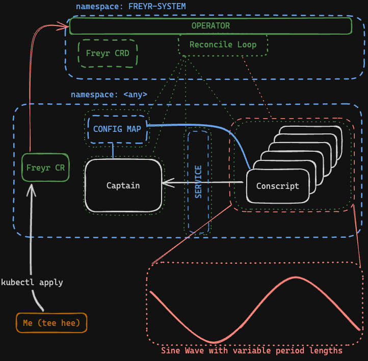

# Freyr

Freyr is an example Go Kubernetes Operator using operator-sdk.

## Getting Started
```shell
# https://sdk.operatorframework.io/docs/building-operators/golang/tutorial/
cd freyr
operator-sdk init --domain=fmtl.au --owner=nick@fmtl.au --project-name freyr;
operator-sdk create api --group freyr --version v1alpha1 --kind Freyr --resource --controller --namespaced=false 
```

## Resources:
* [Operator SDK Go](https://docs.okd.io/latest/operators/operator_sdk/golang/osdk-golang-tutorial.html#osdk-run-operator_osdk-golang-tutorial)
* [KIND SA IMG PULL](https://colinwilson.uk/2020/07/09/using-google-container-registry-with-kubernetes/#step-3---grant-the-service-account-permissions)

## What is it

Freyr is a k8s operator, which manages a basic Captain/Conscript worker registration webapp.

When deployed, it will deploy an operator which manages [Freyr](freyr/api/v1alpha1/freyr_types.go) resources (CRD)

Given the following freyr manifest, the following will be deployed:
```yaml
apiVersion: freyr.fmtl.au/v1alpha1
kind: Freyr
metadata:
  name: freyr-demo
spec:
  mode: trig
  trig:
    duration: 300s
    min: 2
    max: 18
```



## Modes:
* Trig - trigonometric mode. Scale the conscripts based on a generated Sine wave
* Weather - weather mode. Scale the conscripts based on the current temperature of a given city.
  * Uses [openweather api](https://openweathermap.org/current)

View the [Freyr Spec](freyr/api/v1alpha1/freyr_types.go) for more information.

## Demo

When the application is deployed and configured, the Captain deployment should be able to report
via api request about the current state of things. EG:


