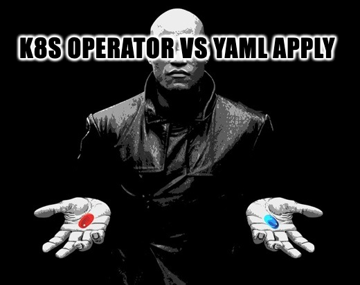
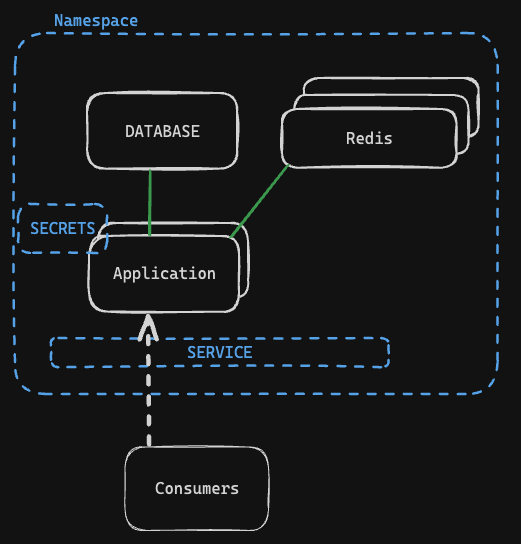
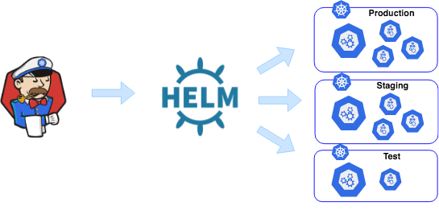
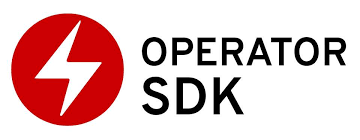

# K8s Operators

> Why

<!-- Today, we will be talking about how to build a kubernetes operator -->

---



<!-- It all starts with a simple deployment. -->

---

# mise en scène




<!-- So you are developing a service to run on K8s. -->
<!-- 
Lets say that you have a basic microservice, that needs to talk to a database, caches some stuff 
(from third party maybe, or session tokens, something right?)
-->

---


## How it starts

```yaml
# two of these probably
apiVersion: apps/v1
kind: StatefulSet 
...
---
apiVersion: apps/v1
kind: Deployment
...
---
apiVersion: v1
kind: Namespace
...
---
apiVersion: v1
kind: ConfigMap
...
---
apiVersion: v1
kind: Service
...
```

<!-- Slap some yaml together to get this mess -->

---

```yaml
apiVersion: apps/v1
kind: Deployment
metadata:
  name: freyr-captain-deployment
spec:
  replicas: 1
  selector:
    matchLabels:
      app: freyr-captain
  template:
    metadata:
      labels:
        app: freyr-captain
    spec:
      containers:
        - name: captain
          image: australia-southeast2-docker.pkg.dev/freyr-operator/imgs/captain:latest
          ports:
            - containerPort: 5001
          livenessProbe:
            httpGet:
              path: /ping
              port: 5001
            initialDelaySeconds: 3
            periodSeconds: 3
          resources:
            requests:
              memory: 100Mi
              cpu: 500m
```

---

# What's wrong here?

- ✅ Nothing at all. Have fun. 

---

# What's wrong here?

- ✅ Declarative
- ❌ DRY
- ❌ Not automated

<!-- Not talking about CD, talking about reactiveness to changes -->

---

## Kustomize

<style scoped>
img {
  width: 500px;
  height: auto;
}
</style>


---

## Kustomize

- ✅ Native
- ✅ Declarative
- ✅ DRY
- ❌ Flexible
- ❌ Not automated
- ❌ Non reactive

<!-- can't have conditional resources, can't react to dynamic changes, can't heal if I delete resources -->

---

## HELM



---

## HELM

- ❌ Native
- ❓ Declarative
- ✅ DRY
- ✅ Flexible
- ❌ Not automated
- ❌ Non reactive
- ❌ Learning Curve

---


---


---

# Operator SDK



---
