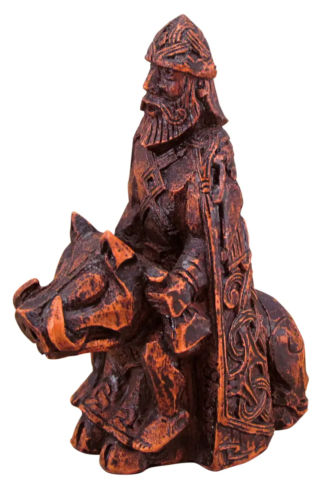

# K8s Operators

> Why

<!-- Today, we will be talking about how to build a kubernetes operator -->

---


<!-- It all starts with a simple deployment. -->

---
# Freyr

> Freyr an Old Norse God, associated with kingship, fertility, peace, prosperity, **fair weather**, and good harvest.



<style scoped>
img {
  width: auto;
  height: 400px;
}
</style>
---
# Freyr


<!-- Explain basics of Freyr application, and it's deployment requirements -->
<!-- How could an operator help an application like this? -->
---


## How it starts

```yaml
# two of these probably
apiVersion: apps/v1
kind: StatefulSet 
...
---
apiVersion: apps/v1
kind: Deployment
...
---
apiVersion: v1
kind: Namespace
...
---
apiVersion: v1
kind: ConfigMap
...
---
apiVersion: v1
kind: Service
...
```

<!-- Slap some yaml together to get this mess -->

---

```yaml
apiVersion: apps/v1
kind: Deployment
metadata:
  name: freyr-captain-deployment
spec:
  replicas: 1
  selector:
    matchLabels:
      app: freyr-captain
  template:
    metadata:
      labels:
        app: freyr-captain
    spec:
      containers:
        - name: captain
          image: australia-southeast2-docker.pkg.dev/freyr-operator/imgs/captain:latest
          ports:
            - containerPort: 5001
          livenessProbe:
            httpGet:
              path: /ping
              port: 5001
            initialDelaySeconds: 3
            periodSeconds: 3
          resources:
            requests:
              memory: 100Mi
              cpu: 500m
```

---

# What's wrong here?

- ✅ Nothing at all. Have fun. 

---

# What's wrong here?

- ✅ Declarative
- ❌ DRY
- ❌ Not automated

<!-- Not talking about CD, talking about reactiveness to changes, different environments etc -->

---

## Kustomize

<style scoped>
img {
  width: auto;
  height: 400px;
}
</style>


---

## Kustomize

- ✅ Native
- ✅ Declarative
- ✅ DRY
- ❌ Flexible
- ❌ Not automated
- ❌ Non reactive

<!-- can't have conditional resources, can't react to dynamic changes, can't heal if I delete resources -->

---

## HELM


---

## HELM

- ❌ Native
- ❓ Declarative
- ✅ DRY
- ✅ Flexible
- ❌ Not automated
- ❌ Non reactive
- ❌ Learning Curve

---


<!--
This is a little bit dramatic, but if you had to develop your own helm charts, damn son.
Helm has its own learning curve, you now have another immensly complicated thing to run, version, package, 
release. fix, maintain, when all you wanted was to just fire and forget (you can still go back to your yaml manifests)
-->
---


---

### ...

---

### OPERATORS!

---

## What is an operator

> Conceptually, an Operator takes human operational knowledge and encodes it into software 
> that is more easily packaged and shared with consumers.

<!-- 
Think of an Operator as an extension of the software vendor’s engineering team that watches over your 
Kubernetes environment and uses its current state to make decisions in milliseconds. 

Operators follow a maturity model that ranges from basic functionality to having specific logic for 
an application. 

Advanced Operators are designed to handle upgrades seamlessly, react to failures automatically, 
and not take shortcuts, like skipping a software backup process to save time.
-->

---

# Operator SDK


<!-- Operator SDK is a frame work that uses controller-runtime (k8s) library to make writing operators easier -->

---

## What does op sdk do?

The Operator SDK is a framework that uses the controller-runtime library to make writing operators easier by providing:

* High level APIs and abstractions to write the operational logic more intuitively
* Tools for scaffolding and code generation to bootstrap a new project fast
* Extensions to cover common operator use cases

<!-- We will only be discussing the Go operators -->

---
## What Level are you (bro)?
<style scoped>
img {
  width: 90%;
  height: auto;
}
</style>


<!-- so where does an operator sit on the scale -->
<!-- Speak to the levels -->

--- 
## The workflow

* Create a new operator project using the SDK Command Line Interface(CLI)
* Define new resource APIs by adding Custom Resource Definitions(CRD)
* Define Controllers to watch and reconcile resources
* Write the **reconciling logic** for your Controller using the SDK and controller-runtime APIs
* Use the SDK CLI to build and generate the operator deployment manifests

<!-- Reconcile Loop here is where all of your code lives -->

--- 

# Back to Freyr


<!-- How could an operator help an application like this? -->
<!-- Does it need to? of course not, it is my contrived example, and I thought it would be funny -->

---

## Installation

```bash
# Install the CRDs
make install

# Deploy the operator
make deploy
```

---

## Installation


<!-- well that is not super interesting -->
---


<style scoped>
img {
  width: auto;
  height: 600px;
}
</style>


---

# Dive through the code

--- 

# Demo

---

# Questions? 
